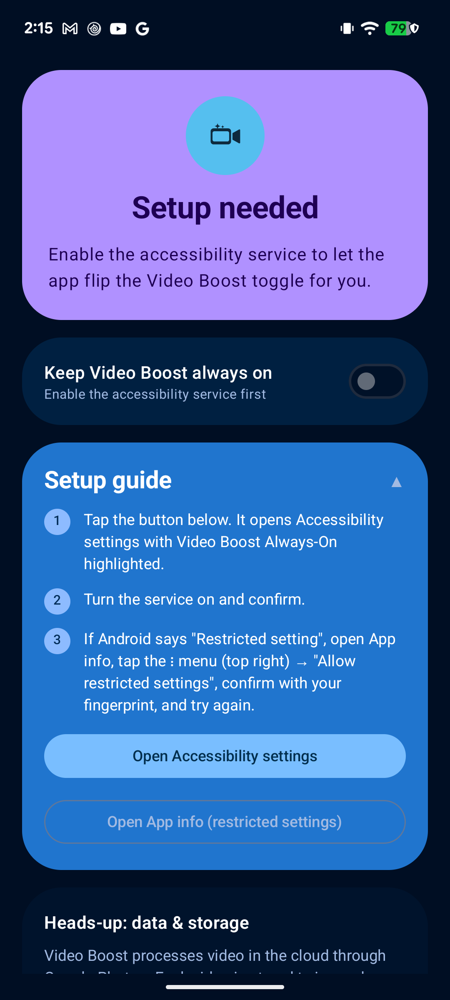
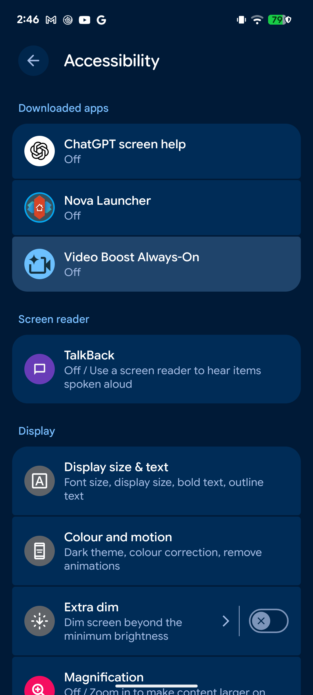
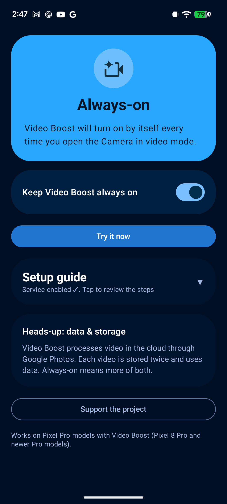
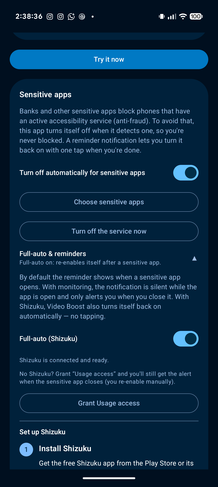

# Video Boost AO (Always-On)

[](https://github.com/AgusRomeroL/video-boost-ao/releases/latest)
[](LICENSE)
[](https://ko-fi.com/agusromero)

**Keep Video Boost always on for your Pixel Pro. No root.**

Pixel Camera deliberately turns Video Boost off every time you close the app
(Google briefly made it persistent in Feb 2025 and then reverted it). There is
no flag, intent or preference that can pin it without root, so this app
re-enables it for you, automatically, every time you open the camera in video
mode.

An `AccessibilityService` detects Pixel Camera in the foreground, opens the
**Video Settings** panel, reads the actual state of the **Video Boost** toggle
and turns it on only if it is off (it never taps blindly; if it is already on
it does nothing). Then it closes the panel to leave the viewfinder exactly as
it found it. The whole sequence takes about half a second.

## Install

New here, or sharing the app with someone? See the
**[visual install & setup tutorial](docs/TUTORIAL.md)**. It covers the two
normal warnings (Play Protect and "restricted setting") with screenshots, and
includes a short blurb you can forward to whoever you send the app to.

### Recommended: Obtainium (automatic updates)

1. Install [Obtainium](https://github.com/ImranR98/Obtainium/releases).
2. Add this app: **[one-tap link](https://apps.obtainium.imranr.dev/redirect?r=obtainium://add/https://github.com/AgusRomeroL/video-boost-ao)**
   (or in Obtainium: *Add App* → paste `https://github.com/AgusRomeroL/video-boost-ao`).
3. Obtainium installs the latest release and updates it automatically from now on.

### Manual

1. Download the APK from the [latest release](https://github.com/AgusRomeroL/video-boost-ao/releases/latest)
   and install it (allow "install unknown apps").

### "App blocked by Play Protect" when installing the APK

Google Play Protect warns about **any** sideloaded app that declares an
accessibility service (the same warning Tasker, MacroDroid, etc. get). It does
not mean the app is unsafe. To proceed:

- Tap the APK again; on the "App blocked" dialog choose **More details** →
  **Install anyway**.
- If that option isn't offered: Play Store → profile → **Play Protect** →
  settings (⚙️) → turn off **Scan apps with Play Protect**, install, then turn
  it back on.
- **Installing via Obtainium avoids most of this friction** (session-based
  install), which is why it's the recommended method above.

The warning eases over time with reputation and by being listed on trusted
sources; it can't be fully removed without Play Store distribution, which this
app avoids on purpose (see *Distribution notes*).

### Then, one-time setup (both methods)

2. Open *Video Boost AO* → the app guides you: tap **Open Accessibility
   settings** (your service entry comes up highlighted) and enable
   *Video Boost Always-On*.
3. If Android shows **"Restricted setting"** (normal for sideloaded apps on
   Android 13+): tap **Open App info** in the app → ⋮ menu (top right) →
   **"Allow restricted settings"** (confirm with fingerprint/PIN) → retry
   step 2.
4. Open Pixel Camera in video mode: within ~0.5 s Video Boost turns on by
   itself (sparkle icon at the top left of the viewfinder). The app also has a
   **Try it now** button.

The app includes a **master switch** to pause/resume the automation without
touching accessibility settings, and checks GitHub for **updates** on launch
(a card appears when a new version is available).

## Screenshots

| Guided setup | Accessibility, highlighted | Active |
|:---:|:---:|:---:|
|  |  |  |
| A guided card walks you through the two permissions. | "Open Accessibility settings" jumps straight to your entry, **highlighted**. | Once enabled, the guide collapses to a checkmark you can reopen anytime. |

Full walkthrough with the "restricted setting" flow: **[install & setup tutorial](docs/TUTORIAL.md)**.

## Enabling the accessibility service (step by step)

Android does not let apps grant themselves this permission; you enable it once,
by hand. The app guides you the whole way:

1. In the app, open the **Setup guide** card and tap **Open Accessibility
   settings**. Android's Accessibility screen opens with **Video Boost
   Always-On highlighted** (see the middle screenshot above).
2. Tap it, turn the switch **on**, and confirm.
3. **If you see "Restricted setting"** (Android 13+ shows this for any app
   installed outside the Play Store): go back to the app, tap **Open App info**,
   then the **⋮** menu (top right) → **Allow restricted settings** → confirm
   with your fingerprint/PIN. Now repeat step 1.
   - If the **⋮** menu is missing: open the app once, swipe it away from
     Recents, then long-press its icon → **App info**; the menu appears there.
4. Back in the app, the hero turns to **"Always-on"** and the master switch is
   enabled. You're done.

You can pause the feature anytime with the **master switch** inside the app;
no need to disable accessibility.

## Features

- Re-enables Video Boost on every camera session, the thing Pixel Camera
  refuses to remember.
- **74 languages**: the UI labels it looks for are not guessed; they are
  extracted directly from the real Pixel Camera APK
  ([`CameraLabels.kt`](app/src/main/java/com/agustin/videoboostao/CameraLabels.kt)).
- **RTL-aware**: in Arabic/Hebrew/Farsi/Urdu the on/off segmented buttons are
  mirrored; the service picks the correct one (verified against the live UI).
- Idempotent and safe: reads the toggle state before acting; never turns
  Video Boost off; gives up quietly after a few attempts if the UI changed.
- Material 3 UI (Compose) with dynamic color, guided onboarding, master
  switch, and an update checker.
- No root, no Shizuku, no analytics. `INTERNET` permission is used solely for
  the GitHub release check.

## Requirements

- A Pixel Pro model with Video Boost (Pixel 8 Pro and newer Pro models).
- Recent Pixel Camera (10.x line, Android 16).

## Heads-up: data & storage

Video Boost processes video in the cloud through Google Photos: each boosted
video is uploaded and stored twice, using data and storage. Always-on means
more of both.

## Troubleshooting

| Symptom | Cause / Fix |
|---|---|
| **"App blocked to protect your device" (Play Protect)** | Expected for any sideloaded accessibility app; not a defect. Tap **More details → Install anyway**, or temporarily disable Play Protect scanning. Obtainium avoids most of this. See the install section. |
| **Can't enable the service ("Restricted setting")** | Normal for sideloaded apps on Android 13+. App info → ⋮ → **Allow restricted settings** → confirm, then enable it (see steps above). Installing via a session-based installer (SAI, or Obtainium) avoids this. |
| **Service enabled, but Video Boost doesn't turn on** | Make sure the camera is in **Video** mode (Video Boost only exists there) and your device actually **has** Video Boost (Pixel Pro, 8 Pro+). Confirm the sparkle icon appears top-left. Check logs: `adb logcat -s VideoBoostAO`. |
| **It worked, then stopped after a Pixel Camera update** | A Feature Drop changed the UI. See *maintenance* below: re-anchor the resource-id and regenerate the localized labels. Open an issue and I'll push a fix. |
| **Nothing happens right after enabling** | Android sometimes needs a moment to bind a freshly enabled service. Close the camera fully and reopen it once. |
| **Boots but toggle looks off in my language** | The labels cover 74 languages extracted from the camera APK. If yours regressed after an update, open an issue with your system language. |
| **Turned it off by accident** | Use the master switch in the app, or if you disabled the accessibility service, just re-enable it; your settings are kept. |
| **Battery/data concern** | Video Boost uploads every video to Google Photos and keeps two copies. Pause with the master switch when you don't need it. |

Found a bug or a language/Feature-Drop regression? Please
[open an issue](https://github.com/AgusRomeroL/video-boost-ao/issues) with
your Pixel model, Android version, Pixel Camera version, and `adb logcat -s
VideoBoostAO` output if you can.

## Sensitive apps (banking, etc.)

Banks and other sensitive apps refuse to run when any non-allowlisted
accessibility service is **enabled** (an anti-fraud measure, since that API can
read the screen). They can't tell that this app is harmless, so they show an
"uninstall this app" block.

To avoid it, the app **turns its own accessibility service off when it detects a
sensitive app in the foreground** (`disableSelf()`), so you're never blocked.

**By default** (no extra setup) it posts a **reminder notification** the moment
the app opens: tap it (once you're done) to turn Video Boost back on in one step.

The built-in list
([`SensitiveApps.kt`](app/src/main/java/com/agustin/videoboostao/SensitiveApps.kt))
covers ~330 apps: the major banks of every country where the Pixel is officially
sold, plus global fintech, crypto wallets, authenticators, and password managers.
Every package is verified against its Google Play listing. In the app you can:

- Toggle the auto-off behavior on/off.
- **Add your own apps** ("Choose sensitive apps") if something isn't covered.
- Turn the service off on demand.
- Enable **Full-auto** or **smart reminders** (below).

### Smarter reminders and full-auto

A disabled accessibility service is blind — on its own it can't tell when you
*leave* the sensitive app. Give the app a way to watch the foreground and it gets
much nicer:

| Setup | While the app is open | When you close it |
|---|---|---|
| **Default** (nothing) | reminder fires immediately | — (you re-enable manually) |
| **Usage access** granted | **silent** "paused" notice | **alerting** reminder to re-enable |
| **Shizuku** (full-auto) | **silent** "paused" notice | **re-enables itself** + a "back on" notice |

So the notification is only *silent* while you're actually in the bank app, and
only *alerts* you once you're out — and with Shizuku you don't even have to tap.

- **Usage access** is a standard Android permission (Settings → Special access →
  Usage access). It only lets the app see which app is in the foreground; nothing
  leaves the device.
- **Shizuku** lets the app re-enable its own accessibility service without root,
  by running the same `settings` command ADB would. Setup below.

### Full-auto with Shizuku (optional)

[Shizuku](https://shizuku.rikka.app/) runs a small helper with shell (ADB-level)
privileges that ordinary apps can talk to — no root required. Video Boost uses it
only to flip its own accessibility service back on after a sensitive app closes.

1. **Install Shizuku** from the Play Store or <https://shizuku.rikka.app/>.
2. **Start Shizuku.** Open it and start the service via **wireless debugging**
   (Android 11+), a **computer with ADB**, or **root**. Follow Shizuku's built-in
   instructions. Note it must be started again after each reboot (its own docs
   cover automating this).
3. In Video Boost open **Sensitive apps → Full-auto & reminders**, turn on
   **Full-auto (Shizuku)**, and **allow** the permission Shizuku prompts for.

<p align="center"></p>

That's it. From then on, opening a sensitive app pauses Video Boost silently and
closing it turns Video Boost back on automatically. If Shizuku ever isn't running,
the app quietly falls back to the reminder notification.

## If it stops working (maintenance)

Pixel Camera Feature Drops can change texts, ids or view hierarchy.

- The panel-entry `resource-id` lives in
  [`Selectors.kt`](app/src/main/java/com/agustin/videoboostao/Selectors.kt);
  localized labels live in `CameraLabels.kt`.
- Re-anchor resource-ids with a live dump (camera in video mode, panel open):

  ```
  adb exec-out uiautomator dump /dev/tty
  ```

- Regenerate localized labels from the real camera APK with
  [`tools/gen-labels.ps1`](tools/gen-labels.ps1):

  ```
  adb shell pm path com.google.android.GoogleCamera   # locate base.apk
  adb pull <base.apk> tools/gcam-base.apk
  aapt2 dump resources tools/gcam-base.apk > tools/gcam-resources.txt
  powershell tools/gen-labels.ps1
  ```

  Relevant resources: `string/sapphire_label` (row label), `string/mode_video`
  (mode chip), `string/sapphire_on_desc` (on-button content description).
  "Sapphire" is Video Boost's internal codename.

Debug logs: `adb logcat -s VideoBoostAO`

## Build

Android SDK (platform 36) + JDK 17 (Android Studio's JBR works):

```
./gradlew assembleDebug     # debug build
./gradlew assembleRelease   # signed release (needs keystore.properties)
```

Release signing reads `keystore.properties` (repo root, gitignored) pointing
to a keystore **outside** the repo:

```properties
storeFile=PATH\\TO\\your-release.keystore
storePassword=...
keyAlias=...
keyPassword=...
```

## Distribution notes

**Not on Google Play, on purpose.** This app uses an `AccessibilityService`
for a non-accessibility purpose (automating another app's UI), which Play's
policy requires declaring and effectively prohibits, with account-level
enforcement risk. Distribution is via GitHub Releases (this repo), Obtainium,
and F-Droid-compatible repos that ship the developer-signed APK.

## Support

If this app saves you a daily tap, you can support development:

[](https://ko-fi.com/agusromero)

## License

[MIT](LICENSE) © 2026 Agustín Romero López
