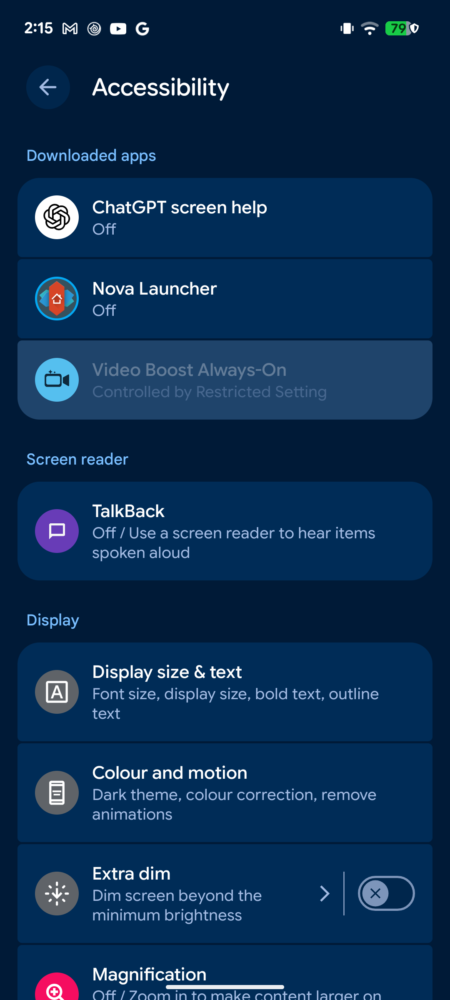
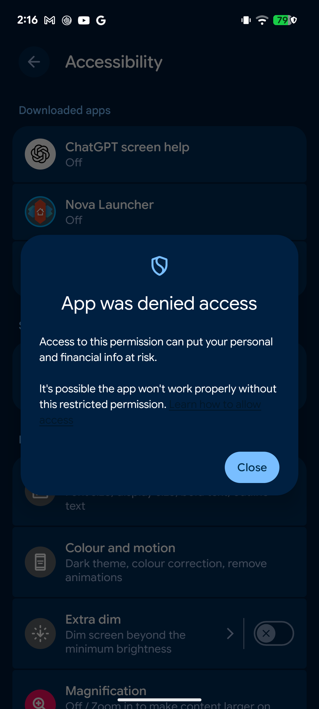
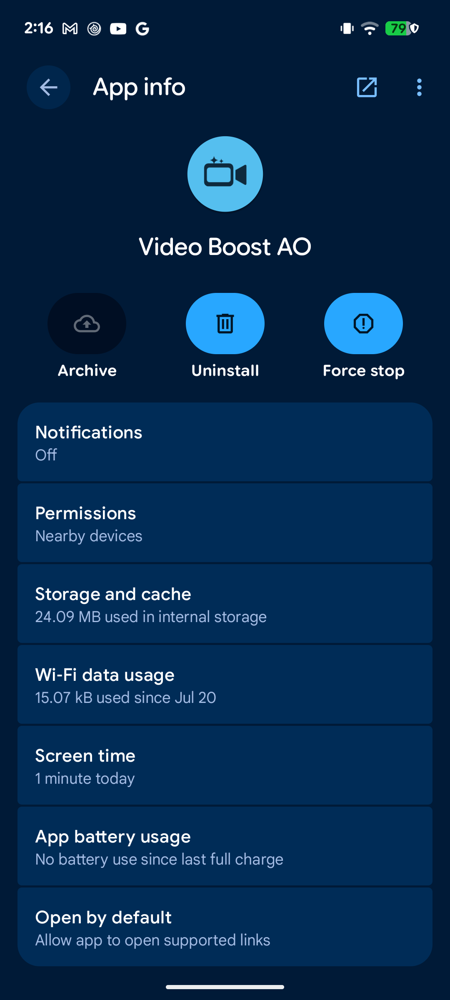
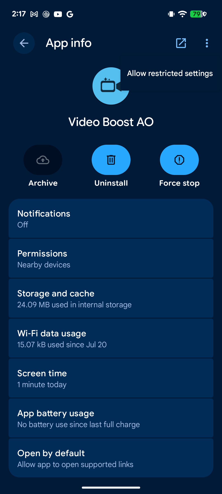
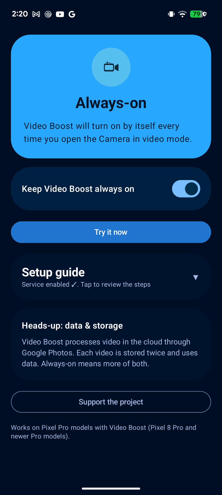

# Video Boost AO: install & setup tutorial

A short, visual walkthrough. It takes about a minute.

## Forward this to anyone you share the app with

> **Video Boost AO** keeps Video Boost on automatically on your Pixel Pro, so
> you never have to flip it on before every video.
>
> When you install it, Android will show two scary-looking warnings. **Both are
> normal for this kind of app and don't mean anything is wrong**. They appear
> for *any* app installed outside the Play Store that automates the screen
> (Tasker, MacroDroid, etc. get the exact same ones):
>
> 1. **"App blocked by Play Protect"**: tap **More details → Install anyway**.
> 2. **"Restricted setting"** when enabling the accessibility service: open the
>    app's **App info**, tap the **⋮** menu → **Allow restricted settings**,
>    confirm with your fingerprint, then enable the service.
>
> The app only reads and taps controls *inside Pixel Camera*. It has no ads, no
> analytics, and its only permission besides accessibility is internet access to
> check for updates. Source code: https://github.com/AgusRomeroL/video-boost-ao
>
> Easiest install with automatic updates: add the repo to
> [Obtainium](https://github.com/ImranR98/Obtainium).

## Why the warnings appear

The whole point of the app is to flip a switch inside Pixel Camera for you. The
only way to do that without root is Android's **accessibility** API. Google
(correctly) treats that API as sensitive, because a malicious app could abuse it
to read the screen. So both Play Protect and the "restricted setting" gate exist
to make you *stop and confirm* before granting it. You are confirming that you
trust this specific app, which you can, because the code is open and it only
touches Pixel Camera. There is no way to remove these prompts without shipping on
the Play Store, which this app avoids on purpose (Play's policy forbids using
accessibility to automate another app's UI).

## Step by step

### 1. Open the app: it tells you what's needed

Fresh install shows **Setup needed**. The master switch is off until the service
is enabled. The **Setup guide** card lays out the three steps.

### 2. Tap "Open Accessibility settings"

The app jumps you straight to Accessibility with **Video Boost Always-On**
highlighted. On a fresh sideload it shows **"Controlled by Restricted Setting"**
and is greyed out. That's the gate we need to lift.

### 3. Tapping it shows the restricted-setting block

Android explains it's blocking the permission. Tap **Close**; we lift the
restriction next.

### 4. Open App info

Back in the app, tap **Open App info (restricted settings)**. (This is the
standard Android App info screen for Video Boost AO.)

### 5. ⋮ menu → "Allow restricted settings"

Tap the **⋮** menu (top right) and choose **Allow restricted settings**. Confirm
with your fingerprint or PIN.

### 6. Enable the service, and you're done

Go back to Accessibility, turn **Video Boost Always-On** on, and confirm. The app
now shows **Always-on**: Video Boost turns on by itself every time you open the
Camera in video mode. The setup guide collapses to a checkmark you can reopen any
time.

That's it. Open Pixel Camera in video mode and you'll see Video Boost switch on
by itself. Use the master switch to pause it whenever you want, without going
back into accessibility settings.

---

*Screens captured on a Pixel 7 (Android 16). The app works on Pixel Pro models
that actually have Video Boost: Pixel 8 Pro and newer Pro models.*
